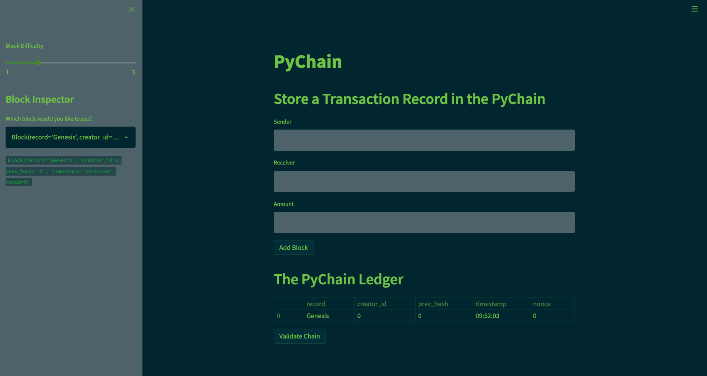
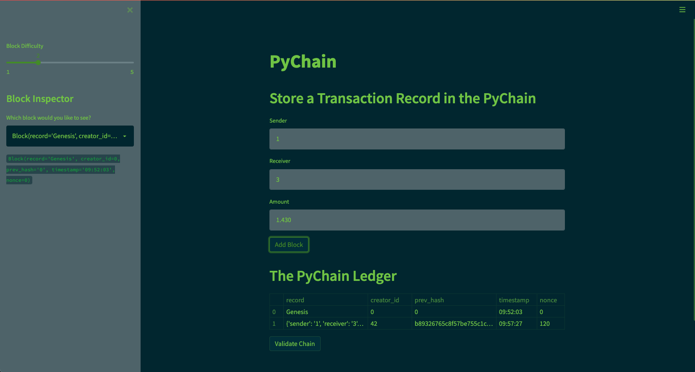
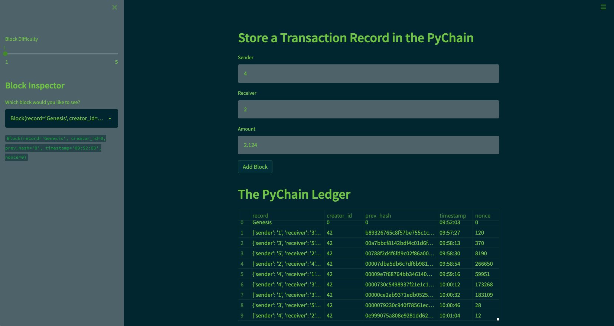
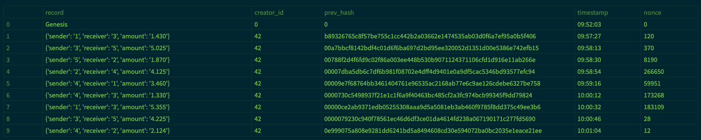
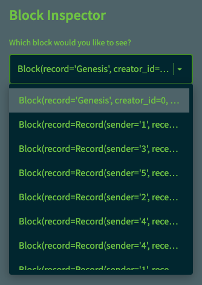
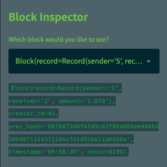
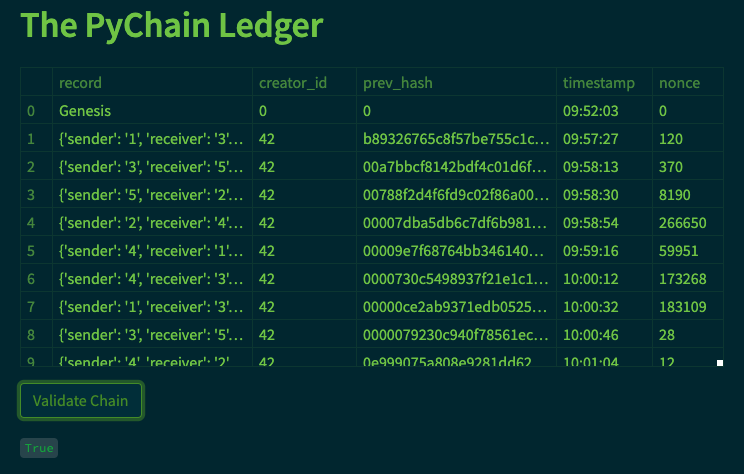
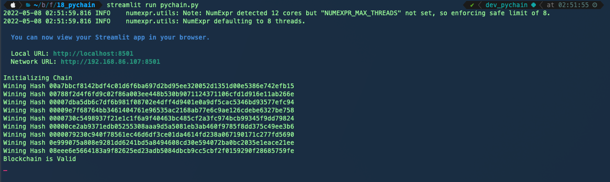
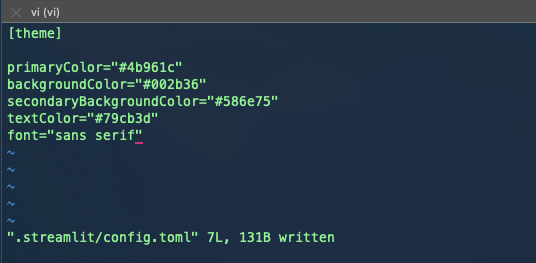

# Block Chain Ledger (PyChain)
## A Blockchain implementation with Python and Streamlit

## Technologies

This block chain ledger was built with the following technologies:

### Language

| Language | Version |
|----------|---------|
| Python   | 3.7.11  |

### Libraries and Frameworks

| Component | Version |
|-----------|---------|
| Anaconda  | 1.9.0   |
| Conda     | 4.11.0  |
| Streamlit | 1.9.0   |

### Operating System

This version of the software is operating system agnostic.

---
## Installation Guide

### Pre-requisites

- Python 3.7
- Anaconda 1.9.0
- Conda 4.11.0
- A conda environment created specially for this project.

### Running the Ledger

1. Install a new conda environment for this project. We will be using `python 3.7.11` for this repository.

```bash
conda create -n dev_pychain python=3.7.11 anaconda
```

2. Activate the newly created environment and verify the python version.

```bash
conda activate dev_pychain
python --version
```

3. Install the required python packages.

```bash
conda install -c anaconda ipykernel
python -m ipykernel install --user --name=dev_pychain
pip install streamlit
```

4. Run the streamlit app

```bash
streamlit run pychain.py
```

---
## Demo Screenshots

1. Booting up streamlit app via terminal

2. PyChain Homepage

3. Adding first block

4. After adding 9 blocks

5. Complete Ledger

6. Block Inspector

7. Block Inspector displaying a block

8. Validating the Chain

9. Terminal displaying hashes and validation

10. Streamlit app design configuration


---
